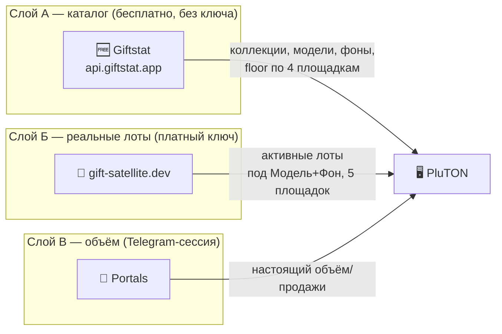
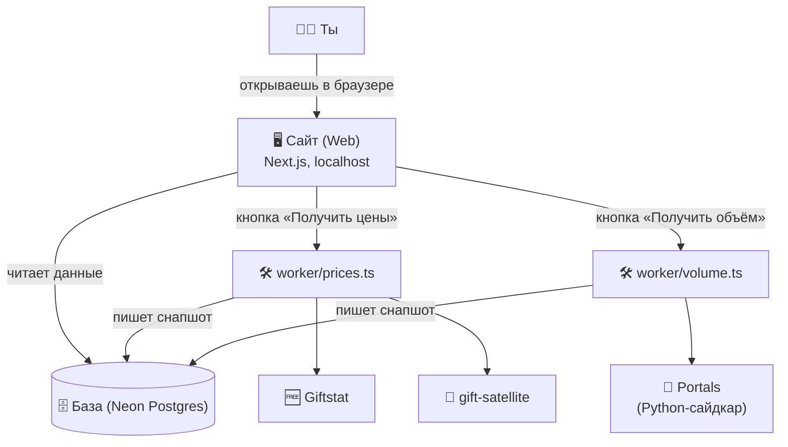

<div align="center">

# 💎 PluTON

**Персональный мультимаркетный трекер цен на коллекционные Telegram-подарки (TON NFT).**
Настраиваешь пресеты «Коллекция → Модель → Фоны» один раз — по кнопке видишь, сколько эта комбинация стоит
прямо сейчас на каждой площадке.


</div>

---

## 📑 Оглавление

1. [Что это такое (простыми словами)](#-что-это-такое-простыми-словами)
2. [Словарь терминов](#-словарь-терминов--каждое-слово-простым-языком)
3. [Как это работает — источники данных](#️-как-это-работает--источники-данных)
4. [Из чего состоит программа](#-из-чего-состоит-программа-архитектура)
5. [Экраны и что на них](#️-экраны-и-что-на-них)
6. [Как читать цену лота](#-как-читать-цену-лота)
7. [Установка и первый запуск](#-установка-и-первый-запуск)
8. [Шпаргалка по командам](#-шпаргалка-по-командам)
9. [Как пользоваться — пошагово](#-как-пользоваться--пошагово)
10. [Как проверить, что данные не врут](#-как-проверить-что-данные-не-врут)
11. [Важные оговорки (честно)](#-важные-оговорки-честно)
12. [Частые вопросы (FAQ)](#-частые-вопросы-faq)
13. [Что дальше (Roadmap)](#-что-дальше-roadmap)
14. [Карта проекта](#-карта-проекта)

---

## 🎯 Что это такое (простыми словами)

Представь блошиный рынок цифровых коллекционных фигурок («Telegram-подарков»), только раскиданный сразу по
**пяти разным площадкам** одновременно — и на каждой свои цены на одну и ту же вещь. Смотреть их вручную
долго и неудобно.

**PluTON — это твоя персональная витрина этого рынка.** Один раз настраиваешь, что тебе интересно
(«Plush Pepe → модель Grumpy → фоны Amber и Black»), и дальше по кнопке видишь колонку с ценами именно этой
комбинации на всех площадках сразу.

**Важно, чем PluTON НЕ является:**
- ❌ не бот и не автопокупщик — ничего не покупает и не продаёт за тебя;
- ❌ не «Deal Finder» и не считает никакой единой «оценки сделки» — только показывает реальные цены как есть;
- ❌ не работает в фоне сам по себе — тянет данные **только когда ты нажал кнопку**;
- ✅ между нажатиями это просто витрина — показывает то, что нашла в прошлый раз (из базы, без обращений к рынку).

---

## 📖 Словарь терминов — каждое слово простым языком

<details open>
<summary><b>Про рынок и предметы</b></summary>

| Термин | Простыми словами | Аналогия |
|---|---|---|
| **NFT** | Запись в блокчейне «эта цифровая вещь принадлежит вот этому человеку». | Именной сертификат на картину |
| **TON** | Криптовалюта, в которой идут расчёты. Все цены в программе — в TON (плюс ⭐Stars и $ рядом). | Валюта этого рынка |
| **Коллекция** | Набор однотипных подарков (напр. «Plush Pepe»). | Серия фигурок одного бренда |
| **Модель (Model)** | Конкретный вариант внутри коллекции (напр. «Grumpy»). | Модель в серии |
| **Фон (Backdrop)** | Цвет/узор фона подарка — вторая ось, по которой различаются экземпляры одной модели. | Цвет корпуса у одной и той же модели |
| **Пресет** | Твоя настройка «Коллекция → Модель → [несколько Фонов]» — одна колонка на витрине. | Сохранённый поиск |
| **Лот / листинг** | Один конкретный предмет, выставленный на продажу с ценой прямо сейчас. | Товар на полке с ценником |
| **Площадка (маркет)** | Где выставляют лоты: Telegram, Portals, Tonnel, MRKT, Getgems. | Магазин / барахолка |
| **Floor** («флор») | Самая низкая цена в коллекции прямо сейчас. | Ценник самого дешёвого товара на полке |
| **× от floor** | Во сколько раз цена лота дороже/дешевле floor'а. Зелёное — ниже floor, красное — выше. | «На сколько % это дороже минимальной цены» |
| **Прогон (run)** | Один заход: нажал кнопку — программа обошла площадки и сохранила снапшот в базу. | Один «поход на рынок» |

</details>

<details>
<summary><b>Про устройство программы (нажми, чтобы раскрыть)</b></summary>

| Термин | Простыми словами |
|---|---|
| **Витрина** | Главный экран (`/`) — колонки по пресетам с ценами последнего прогона. Читает базу, к рынку сама не ходит. |
| **Giftstat** | Бесплатный источник каталога/floor без ключа — коллекции, модели, фоны, цены-ориентиры. |
| **gift-satellite** | Платный источник конкретных активных лотов под комбинацию Модель+Фон на каждой площадке — единственное, чего Giftstat не отдаёт. |
| **Portals** | Площадка, которая единственная отдаёт **настоящий** объём/продажи (для вкладки «Объёмы»). |
| **Degraded** | Все площадки пресета упали за раз — колонка честно показывает «Источник временно недоступен» вместо пустоты. |
| **isPartial** | На вкладке «Объёмы»: число за 7д/30д не успело досчитаться до конца истории — помечено ⚠, не выдаётся за полное. |
| **Cooldown** | Минимальная пауза между прогонами (по умолчанию 3 мин для цен, 15 мин для объёма), чтобы не долбить площадки зря. |

</details>

---

## ⚙️ Как это работает — источники данных

Важно понимать: у PluTON **три независимых источника**, каждый со своей ролью. Это не одна большая
«магическая» база — если что-то выглядит странно, полезно понимать, из какого источника это пришло.



- **Giftstat** (`api.giftstat.app`) — полностью бесплатный, без ключа. Отдаёт список коллекций, моделей,
  фонов и floor-цену по 4 площадкам (Portals, Tonnel, Fragment, Getgems). Питает dropdown'ы в пресетах и
  чип `× от floor`. Не отдаёт и **не может** отдать цену конкретного лота под конкретный фон — только
  агрегаты.
- **gift-satellite.dev** — платный ключ, нужен только для одной вещи: реального списка активных лотов под
  твою комбинацию Модель+Фон на 5 площадках (Telegram, Portals, Tonnel, MRKT, Getgems). Это и есть колонки
  на витрине.
- **Portals** — единственный источник **настоящего** объёма торгов (не оценка, а реальные продажи). Нужен
  Telegram-сессия (вводится мастером в `/settings`, консоль не требуется).

**Набор площадок у Giftstat (floor) и у gift-satellite (лоты) не совпадает** — у Giftstat нет Telegram/MRKT,
но есть Fragment; у gift-satellite наоборот. Поэтому чип `× от floor` и цены лотов под ним иногда смотрят
на чуть разные подмножества рынка. Это осознанное решение, не баг — площадки физически разные, усреднять
их в одно число значило бы врать.

---

## 🧩 Из чего состоит программа (архитектура)



| Часть | Что это | Зачем отдельно |
|---|---|---|
| **Сайт (Web)** | Next.js. Экраны + кнопки-триггеры. Между прогонами только читает базу. | Быстрый, не ждёт рынок. |
| **Воркеры** | `prices.ts`/`volume.ts` — отдельные процессы, спавнятся кнопкой, не крутятся в фоне сами. | Прогон может занимать десятки секунд — сайт столько ждать не должен. |
| **База** | Postgres на [Neon](https://neon.tech), доступ по HTTPS/443 (не обычный 5432). | Витрина живёт из базы между прогонами, не трогая рынок зря. |

**Проект запускается только локально** — веб и воркеры как процессы на твоей машине, без облачного
хостинга (см. `DEPLOY.md`). Единственный внешний сервис инфраструктуры — сама база на Neon.

**Стек:** Next.js 15 (App Router) · React 19 · TypeScript · Tailwind CSS · Prisma · PostgreSQL на Neon ·
воркеры на `tsx` · Python-сайдкар для Portals.

---

## 🖥️ Экраны и что на них

### 1. 📊 Витрина (`/`) — главный экран
Кнопка **«Получить цены»** + горизонтальные колонки, одна колонка = один пресет (модель). Внутри —
**один список лотов по всем выбранным фонам сразу, отсортированный по цене** (фон каждого лота — цветной
бейдж прямо на карточке, не отдельная секция). Сверху — панель «Фильтр»: сортировка по цене возр./убыв. и
включение/выключение отдельных площадок — применяется мгновенно, без новых запросов к рынку.

### 2. 🗂️ Мои пресеты (`/presets`)
Каскадная форма «Коллекция → Модель → Фоны» (с миниатюрами и floor-ценой прямо в dropdown'е) + список уже
сохранённых комбинаций. Повторное добавление той же модели **добавляет** новые фоны к уже выбранным, а не
затирает их.

### 3. 📈 Объёмы (`/volumes`)
Таблица коллекций по настоящему объёму торгов с Portals за выбранный период (24ч/7д/30д), floor, топ-3
модели по продажам, ссылки на площадки. Строки с неполными данными помечены ⚠.

### 4. ⚙️ Ключ (`/settings`, через меню профиля)
Ввод API-ключей: `GIFT_SATELLITE_KEY` (обязателен для входа), `TONAPI_KEY` (опционален), Telegram-креды
для Portals — с мастером входа прямо в браузере (телефон → код → 2FA), консоль не нужна.

### 5. 🚀 Онбординг (`/onboarding`)
Показывается один раз при первом запуске: заставка → по одному полю ключи → готово. `/settings` остаётся
доступен и после — постоянная точка для смены ключей.

---

## 💰 Как читать цену лота

Никакой формулы «оценки сделки» нет — PluTON просто показывает рынок как есть.

- **Цена всегда тройкой**: `💎 12.4 TON` + `⭐ 1420 Stars` + `~$19.2` — голых чисел без пары в интерфейсе
  не бывает.
- **Чип `× от floor`**: `1.24×` значит лот на 24% дороже текущего floor'а коллекции, `0.88×` — на 12%
  дешевле. Зелёный — ниже floor, красный — выше.
- **Площадка (Platform)** и **фон (Фон)** — на самой карточке лота, кликабельна ведёт прямо на площадку,
  где лот выставлен.

---

## 🚀 Установка и первый запуск

### Что нужно заранее
- **Node.js 20+** и `npm`.
- **База данных на [Neon](https://neon.tech)** (бесплатно) — регистрируешься, создаёшь проект, копируешь
  connection string.
- Аккаунт на **gift-satellite.dev** для платного ключа (обязателен для входа в приложение сейчас — см.
  [оговорки](#-важные-оговорки-честно)).

> ℹ️ Программа подключается к Neon по HTTPS/443, а не по обычному 5432 — так работает даже там, где 5432
> закрыт файрволом. Подробности — `CLAUDE.md` §1.

### Шаги

```bash
# 1. Скопировать шаблон настроек окружения
cp .env.example .env
# Заполни DATABASE_URL (строка из Neon) и сгенерируй SETTINGS_ENCRYPTION_KEY:
#   openssl rand -hex 32
# (остальные ключи в .env НЕ вписываются — вводятся через веб-форму)

# 2. Установить зависимости
npm install

# 3. Засеять стартовые настройки
npm run db:seed

# 4. Запустить сайт
npm run dev
#   → http://localhost:3000 — первый запуск перекинет на мастер /onboarding
```

Мастер онбординга попросит `GIFT_SATELLITE_KEY` (обязательно) и предложит опционально сразу настроить
`TONAPI_KEY`/Telegram-креды для вкладки «Объёмы» (можно пропустить и добавить позже в `/settings`).

Для вкладки «Объёмы» дополнительно нужен локальный Python 3 (`pip install -r requirements.txt`) — детали
в `DEPLOY.md`.

---

## 📋 Шпаргалка по командам

| Команда | Что делает |
|---|---|
| `npm run dev` | Запустить сайт (`localhost:3000`) |
| `npm run build` | Собрать боевую версию |
| `npm run db:seed` | Залить стартовые настройки (безопасно повторять) |
| `npm run worker:prices [-- --force]` | Прогон «Получить цены» вручную из терминала |
| `npm run worker:volume -- --period=24h\|7d\|30d [-- --force]` | Прогон «Получить объём» вручную |
| `npm run portals:health` | Проверить, жива ли Telegram-сессия для Portals |
| `npm run portals:login` | Консольный фолбэк получения Telegram-сессии (обычно не нужен — есть мастер в `/settings`) |
| `npm run onboarding:reset` / `onboarding:restore` | Симуляция первого запуска для тестирования мастера |
| `npm run typecheck` | Проверить типы TypeScript |

---

## 🧭 Как пользоваться — пошагово

**Шаг 1 — пройди онбординг.** Первый запуск сам перекинет на `/onboarding`. Обязательно нужен только
`GIFT_SATELLITE_KEY` — остальное можно пропустить кнопкой Skip и добавить позже.

**Шаг 2 — заведи пресет.** На **«Мои пресеты»** выбери коллекцию → модель → один или несколько фонов →
«Добавить в избранное».

**Шаг 3 — получи цены.** На **«Витрина»** нажми **«Получить цены»**. Прогон занимает от десятков секунд до
пары минут (зависит от числа пресетов × 5 площадок × числа фонов) — прогресс-бар и лог видны прямо в
интерфейсе, вкладку можно не держать открытой.

**Шаг 4 — читай колонку.** Одна колонка = одна модель, лоты отсортированы по цене по всем твоим фонам
сразу. Кликабельная карточка ведёт на площадку.

**Шаг 5 — подстрой фильтр.** Кнопка «Фильтр» над колонками — сортировка по возр./убыв. и включение
отдельных площадок, применяется мгновенно без нового прогона.

**Шаг 6 — (опционально) получи объём.** На **«Объёмы»** выбери период и нажми «Получить объём» — нужна
настроенная Telegram-сессия (мастер в `/settings`).

**Шаг 7 — повторяй по кнопке.** Данных фонового обновления нет намеренно — свежие цены только когда сам
нажал.

---

## 🔍 Как проверить, что данные не врут

- **Клик по лоту** ведёт прямой ссылкой на площадку — можно свериться глазами. Лота там уже нет? Значит
  его купили/сняли между прогоном и твоим кликом, это нормальный дрифт живого рынка.
- **`GET /api/prices`** отдаёт честный статус (`ok`/`failed`) по каждой площадке каждого пресета за
  последний прогон — если площадка `failed`, значит её не удалось спросить, а не что там пусто.
- **Бейдж ⚠ на «Объёмах»** прямо говорит, что число за 7д/30д неполное (не хватило глубины истории), не
  выдаёт частичные данные за полные.
- **Ссылка на Getgems** в «Объёмах» — единственная надёжная прямая ссылка на коллекцию (по on-chain
  адресу); Portals/Fragment дают только вход в площадку — у них физически нет публичного детерминированного
  URL на конкретную коллекцию.
- **Giftstat открыт и без ключа** — если сомневаешься в floor-цифре, сверься напрямую:
  `https://api.giftstat.app/current/collections/floor?marketplace=portals`.
- **«Источник временно недоступен»** на колонке — честный сигнал, что упали ВСЕ площадки пресета, а не
  что лотов нет.

---

## ⚠️ Важные оговорки (честно)

- **Никакой формулы «оценки сделки» нет.** PluTON не говорит, дёшево это или дорого относительно
  «справедливой» цены — только реальную цену на реальной площадке прямо сейчас. Решение — на тебе.
- **`GIFT_SATELLITE_KEY` сейчас обязателен для входа в приложение целиком**, хотя технически каталог и
  floor давно не требуют платного ключа (это делает бесплатный Giftstat) — ключ реально нужен только для
  самого дорогого шага, живого поиска лотов. Это сознательно отложенная работа, не недосмотр.
- **Набор площадок у floor-чипа и у реальных лотов не совпадает** (см. [раздел про источники](#️-как-это-работает--источники-данных)) — не пытайся свести их в одно число, это разные подмножества рынка.
- **Настоящий объём есть только у Portals.** Если в будущем добавятся другие площадки (MRKT, Tonnel и
  т.п.), у многих из них «объём» считается по внутренним депозитам/выводам пользователей, а не по
  фактическим сделкам с подарками — это НЕ то же самое, что реальный ончейн-объём, и мы не будем выдавать
  одно за другое.
- **7д/30д объём может быть неполным** — у Portals лента продаж постранична и ограничена бюджетом времени
  прогона; такие строки честно помечены, не досчитаны «на глаз».
- **Это не финансовый совет.** Инструмент только показывает, решение и риск — на тебе.

---

## ❓ Частые вопросы (FAQ)

**Почему для входа нужен платный ключ, если каталог вроде бесплатный?**
Исторически ключ гейтил всё приложение. С переходом каталога/floor на бесплатный Giftstat это стало строже,
чем нужно технически — но пока не переделано (см. оговорки выше). Реально ключ используется только для
поиска живых лотов.

**Почему на витрине нет секций по фону, как раньше?**
Раньше сортировка по цене сбрасывалась на каждом новом фоне — по фидбэку это убрали: теперь один список,
отсортированный по цене целиком, фон — просто бейдж на карточке.

**Прогон «Получить цены» долго идёт — это нормально?**
Да, площадка Telegram троттлится сильнее других (~1 запрос в 1.5 сек), при большом числе пресетов/фонов
прогон может занимать пару минут. Прогресс виден в реальном времени.

**Нажал «Получить цены», а кнопка недоступна.**
Либо идёт cooldown (по умолчанию 3 минуты между прогонами), либо предыдущий прогон ещё не завершился —
таймер/индикатор видны на самой кнопке.

**Можно ли добавить свою площадку помимо текущих пяти?**
Пока нет — планируется (см. Roadmap).

**Программа сама покупает выгодные лоты?**
Нет, только показывает. Покупаешь ты сам, руками, на площадке.

---

## 🗺️ Что дальше (Roadmap)

- [ ] Сделать `GIFT_SATELLITE_KEY` по-настоящему опциональным (каталог уже не зависит от него — привести
      гейт входа в приложение в соответствие)
- [ ] MRKT — та же Telegram-сессия, что и Portals, почти бесплатное расширение покрытия площадок
- [ ] Getgems — честный ончейн-объём вторым источником к Portals
- [ ] Tonnel / Fragment — отдельная авторизация под каждую
- [ ] История floor/цен между прогонами, не только последний снапшот

---

## 📁 Карта проекта

```
PluTON/
├── src/
│   ├── app/                    # Экраны
│   │   ├── page.tsx             #   Витрина (/)
│   │   ├── presets/              #   Мои пресеты
│   │   ├── volumes/              #   Объёмы
│   │   ├── settings/             #   Ключи API
│   │   ├── onboarding/           #   Мастер первого запуска
│   │   └── api/                  #   Триггеры: /prices, /volume, /presets, /settings, /collections...
│   ├── components/              # Showcase, PresetColumn, LotCard, VolumeTable, PresetForm, SettingsForm...
│   └── lib/                     # giftstat.ts (каталог/floor), giftSatellite.ts (лоты), portals.ts (объём),
│                                 # secrets.ts (шифрование ключей), db.ts (Neon)
├── worker/                      # Отдельные процессы-сборщики
│   ├── prices.ts                 #   Движок витрины
│   ├── volume.ts                 #   Движок объёмов
│   ├── portals_fetch.py          #   Python-сайдкар Portals
│   └── scan.ts                   #   Legacy tonapi-скан (вне пути витрины)
├── prisma/                       # Схема базы данных + сид
├── DEPLOY.md                     # Подробная инструкция по локальному запуску
├── CLAUDE.md                     # Технические инварианты проекта (для разработки)
└── PROJECT_BRIEF.md              # Исходный замысел
```

---

<div align="center">

**PluTON** — показывает рынок как есть, площадка за площадкой, решение оставляет за тобой.

</div>
